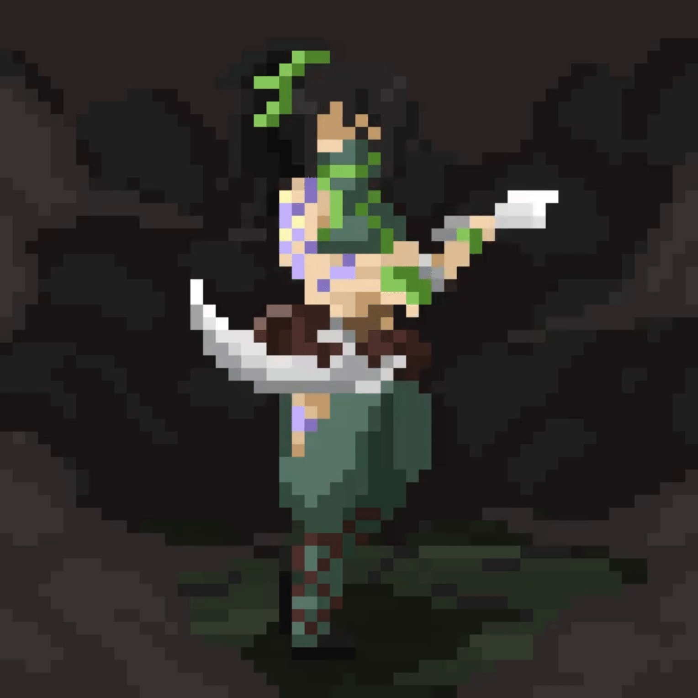

<h2 align="left">Hi 👋! My name is Giovanni Yuri and I'm a SRE Analyst at BW Soluções</h2>

###

###

  
  
  
  
  
  
  
  
  
  
  
  
  
  
  
  
  
  
  
  
  

###

  
  

###

  

###

 

###
